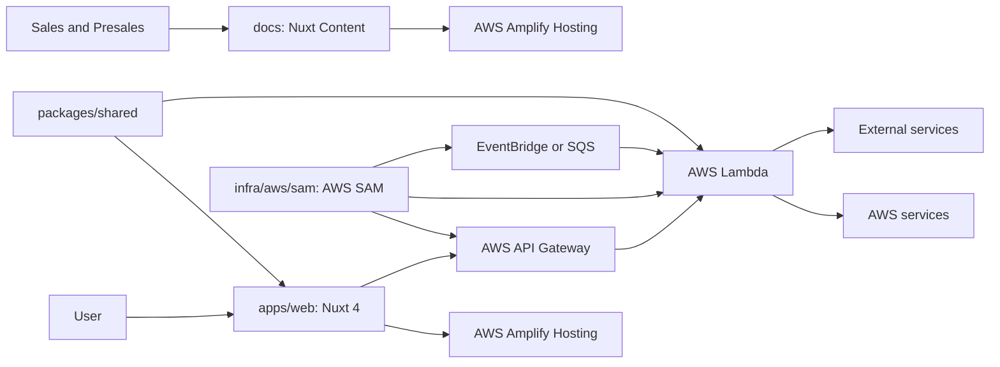

# System Overview

この monorepo は、Nuxt 4、AWS Amplify Hosting、AWS SAM を標準アーキテクチャとして採用します。ユーザー接点、ドキュメント、サーバー API、非同期処理、共有契約、運用基盤を分離して扱います。

AI Agent は、このアーキテクチャを推奨構成として前提にします。この構成で実現できない、または責務境界に矛盾する場合のみ、利用者へ確認します。

## 標準アーキテクチャ

## 採用技術

- Frontend: Nuxt 4。
- UI: Nuxt UI、Tailwind CSS。
- Web hosting: AWS Amplify Hosting。
- Docs: Nuxt 4、Nuxt Content、Nuxt UI。
- Infrastructure as Code: AWS SAM。
- Backend on AWS: API Gateway、Lambda、EventBridge、SQS、DynamoDB、Secrets Manager、IAM を必要に応じて利用する。
- Package manager: pnpm。

## 主要領域

- Web App: ユーザー体験、画面遷移、フォーム、表示状態を担当する。
- Server API: アプリケーションから利用する API、入力検証、認可境界、外部連携の入口を担当する。
- Backend API: AWS SAM で定義する API Gateway と Lambda。外部 webhook、永続化、認可境界、外部サービス連携を担当する。
- Async Processing: AWS SAM で定義する EventBridge、SQS、Lambda。定期処理、非同期処理、データ同期、通知、集計を担当する。
- Shared Contracts: 型、スキーマ、エラー形式、DTO、ドメイン非依存のユーティリティを担当する。
- Infra: 実行環境、デプロイ、権限、監視、ジョブ定義を担当する。
- Docs: 設計合意、運用手順、開発スコープを担当する。

## 原則

ユーザー接点から始まる処理は Web App から API に向かいます。Web アプリに閉じる軽量な API は Nuxt `server/api` に置けますが、外部 webhook、永続化、非同期処理、権限管理、外部サービス連携は AWS SAM で定義する backend API に寄せます。

非同期処理は AWS SAM で定義する Lambda、EventBridge、SQS が担当し、Web App に定期処理の責務を持たせません。共有契約は Shared Contracts に集約し、各アプリや Lambda が独自に意味を変えないようにします。

## Deployment Model

- `apps/web`: `apps/web/amplify.yml` を使い、AWS Amplify Hosting へデプロイする。
- `docs`: `docs/amplify.yml` を使い、AWS Amplify Hosting へ静的 docs としてデプロイする。
- `infra/aws/sam`: root script の `sam:validate`、`sam:build`、`sam:deploy` から AWS SAM を実行する。

AWS SAM のテンプレートと関数コードは、必要になった時点で `infra/aws/sam` に追加します。

## AI Agent へのルール

実装対象が複数領域にまたがる場合は、delivery のタスクで Primary Area と影響範囲を確認します。責務が曖昧な変更は、先に responsibility boundary を確認してから実装します。

Nuxt 4、AWS Amplify Hosting、AWS SAM の採用可否を毎回質問しません。既存 design の標準アーキテクチャで実現できない場合だけ、代替案と理由を提示して確認します。
