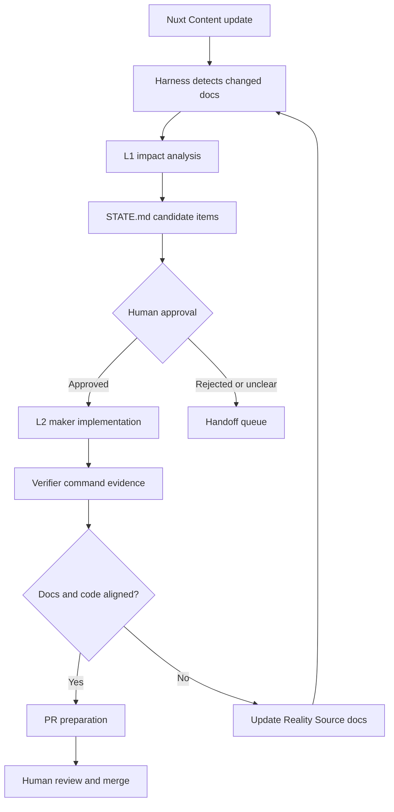

# Loop Engineering Architecture

Loop Engineering は、Nuxt Content に記載した要件、設計、運用、保守ドキュメントを Reality Source として、AI Agent が影響分析、実装、検証、Pull Request 作成まで進めるためのパイプラインです。

L1 は最終成果ではありません。L1 は後続の L2、L3 が利用する候補アイテム、影響範囲、検証観点を `STATE.md` に残すための入口です。

## Reality Source

Reality Source は `docs/content/` です。

- `delivery`: 現在スコープ、タスク、受け入れ条件、実装フロー。
- `design`: 理想設計、責務境界、アーキテクチャ、Loop Engineering の最終形。
- `operations`: 繰り返し使う実行手順、ローカル運用、検証手順。
- `maintenance`: 状態管理、検証証跡、PR ライフサイクル、運用後の保守ルール。

Root の `STATE.md`、`SKILL.md`、`LOOP.md` は Reality Source ではありません。これらは Harness と Agent が短期的に参照する実行時メモリと入口です。

## Pipeline

## Components

| Component | Role |
| --- | --- |
| Nuxt Content | Reality Source for scope, design, operations, maintenance, and acceptance criteria. |
| Harness | Reads changed docs, maps impact, gates L2/L3, and runs verifier command sets. |
| `STATE.md` | Derived state for candidates, approvals, attempts, active work, verifier evidence, and handoff triggers. |
| Maker | Implements approved work only, within scope and outside denylisted paths. |
| Verifier | Runs typecheck, lint, test, build, and task-specific checks with evidence. |
| GitHub Actions | Runs L1 on docs changes and scheduled triage; later prepares approved PRs. |

## Design Principles

- Docs are authoritative; code follows docs or docs are updated when reality changes.
- L1, L2, and L3 are stages of one pipeline, not separate products.
- `STATE.md` must contain enough structured information for the next loop to continue.
- Maker and Verifier must not collapse into the same judgment.
- Completion requires command evidence, not narrative confidence.
- L3 is disabled until L2 produces stable, reviewable PRs.

## Handoff Conditions

The loop stops and asks for human decision when:

- A candidate reaches three attempts.
- Required work touches denylisted paths.
- Verification fails twice for the same reason.
- Docs conflict and the priority rules do not resolve the conflict.
- Budget or token caps would be exceeded.
- The requested work expands beyond Current Scope.

