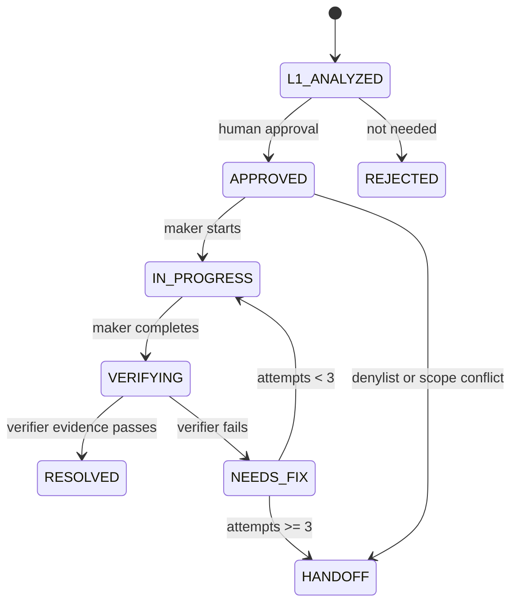

# Loop State Management

`STATE.md` is derived state. It is not the Reality Source, but it is required for loops to continue across sessions.

## State Sections

| Section | Purpose |
| --- | --- |
| Runtime Policy | Current caps, tier, and write surface. |
| Readiness Score | Promotion readiness for L2 and L3. |
| Candidate Items | L1 output and L2 input. |
| Active Work | Current maker or verifier work. |
| Verification Evidence | Command evidence and result records. |
| Resolved Items | Completed items with evidence. |
| Handoff Queue | Items blocked by policy, ambiguity, budget, or repeated failure. |
| Loop Run Log | Chronological run history. |

## Candidate State Transitions

## Required Candidate Fields

Each candidate must include:

- ID,
- stage,
- approval status,
- attempts,
- source docs,
- impact area,
- maker action,
- verifier expectation.

## Task Schema State

Loop task Markdown under `docs/content/delivery/scopes/**/tasks/*.md` is the Reality Source for task-level state. The Harness validates these fields before a Maker or Verifier treats a task as actionable.

Required task fields:

- `id`
- `status`
- `autonomy`
- `source_of_truth`
- `primary_area`
- `acceptance_criteria`
- `verification_commands`
- `handoff_conditions`
- `last_evidence`

Allowed `status` values:

- `planned`: defined but not approved for implementation.
- `approved`: approved target task.
- `in_progress`: maker work is underway.
- `verifying`: verifier commands are the next action.
- `resolved`: verifier evidence completed the task.
- `blocked`: handoff condition or blocker prevents progress.

Allowed `autonomy` values:

- `manual`: inspect and report only.
- `assisted`: edit only within approved task scope and `primary_area`.
- `autonomous`: act within task schema, harness gates, denylist, budget, and verifier requirements.

`verification_commands` and `handoff_conditions` must be non-empty. A task without either field cannot move into maker or verifier work because the loop cannot prove completion or know when to stop.

## Handoff Rules

Move to handoff when:

- attempts reach three,
- budget is exceeded,
- denylisted paths are required,
- docs conflict cannot be resolved,
- verification fails twice for the same cause,
- credentials or external permissions are required.
