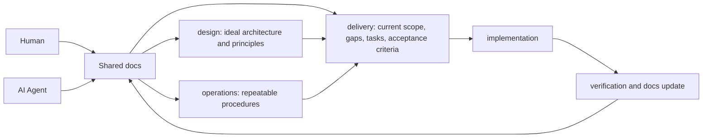

# Getting Started

Getting Started は、環境構築手順ではありません。設計書を書くための手順でもありません。

このページは、AI Agent と人間が共通理解を作るための最初の会話手順です。利用者はアーキテクチャやドキュメント構造を考える必要はありません。まず作りたいものを説明してください。AI Agent が設計思想、標準手順、現在スコープへ整理します。

アプリケーションの依存関係インストールや起動確認は Initial Setup に置きます。このページでは、利用者が「何を作りたいか」を AI Agent に伝え、最初の docs を作るところまでを扱います。

## 目的

- 利用者が作りたいものを自然言語で説明する。
- AI Agent が追加質問を通じて前提を補う。
- AI Agent が docs を整理し、実装前に確認できる共通理解を作る。
- 初見ユーザーでも 30 分以内に開発を始められる入口にする。

## Concept Flow



## Step 1: 作りたいものを説明する

入力テンプレートを埋める必要はありません。利用者は、普段の言葉で「何を作りたいか」を説明します。

最初は、次の程度が分かれば十分です。

- 何を作りたいか。
- 誰が使うか。
- 何ができるようになれば成功か。
- 将来的にやりたいこと。
- 今は考えないこと。

この段階で、`design`、`operations`、`delivery` の違いを理解している必要はありません。docs の置き場所や構成は AI Agent が整理します。

## Step 2: AI Agent に最初の整理を依頼する

初見ユーザーは、次のプロンプトをコピーして使えます。docs 構造を理解していなくても利用できます。

```txt
このリポジトリで実現したいことを説明します。

まずコードは変更せず、設計思想を整理してください。
必要であれば追加で質問してください。
その後、design、operations、delivery を整理してください。
Documentation Operations を参照し、docs の配置ルールに従って整理してください。

私は docs の構造をまだ理解していないため、どこに何を書くべきかは AI Agent が判断してください。

作りたいもの:
[ここに自然言語で説明を書く]

使う人:
[分かる範囲で書く]

成功条件:
[何ができれば成功かを書く]

将来的にやりたいこと:
[あれば書く]

今は考えないこと:
[あれば書く]
```

## Step 3: docs を確認する

AI Agent が docs を作成したら、利用者は次の観点だけ確認します。

- 作りたいものの理解が合っているか。
- 今回作る範囲が大きすぎないか。
- 成功条件が確認できる形になっているか。
- 今は考えないことが明確になっているか。

分類や置き場所に違和感がある場合は、利用者が細かく修正する必要はありません。「この部分は今すぐ作る範囲ではない」「この成功条件を追加したい」のように自然言語で伝えれば十分です。

## Step 4: 実装サイクルへ進む

Getting Started 完了後は、次の流れで開発を進めます。

```text
Getting Started
↓
AI Agent が docs を作成
↓
Current Scope を確認
↓
実装対象タスクを選択
↓
AI Agent に実装依頼
↓
検証
↓
docs 更新
↓
次タスクへ
```

日常的な Document Driven Development では、まず docs で現在スコープと成功条件を確認し、その範囲で実装し、検証結果に合わせて docs を更新します。

## FAQ

### design と delivery の違いを理解していなくても利用できますか？

利用できます。利用者は作りたいものと成功条件を説明してください。AI Agent が Documentation Operations を参照して、理想設計、標準手順、現在スコープへ整理します。

### docs は後から変更できますか？

変更できます。最初の docs は完成版ではなく、AI Agent と人間が会話するためのたたき台です。作るものや優先順位が変わったら docs も更新します。

### AI Agent が設計を提案した場合はどう判断しますか？

提案が「作りたいもの」「成功条件」「今は考えないこと」に合っているかを確認します。専門的な構成名よりも、実際に進めたい開発に合っているかを優先します。

### docs と実装がずれた場合はどうしますか？

ずれを見つけたら、実装を直すのか docs を更新するのかを判断します。理想や合意が変わったなら docs を更新し、実装が合意から外れているなら実装を直します。

### 最初から完璧な設計を書く必要がありますか？

必要ありません。最初は「何を作りたいか」「何ができれば成功か」「今は考えないこと」が分かれば十分です。細かい設計は、AI Agent との会話と実装サイクルの中で育てます。

## Done

- 作りたいものが自然言語で説明されている。
- AI Agent が必要な追加質問をしている。
- `docs/content/design`、`docs/content/operations`、`docs/content/delivery` の初期整理がある。
- Current Scope と実装対象タスクを確認できる。
