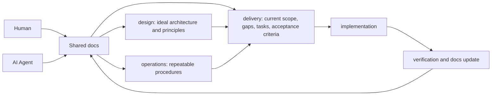

# Getting Started

Getting Started は、AI Agent と人間が同じ前提を読んでから実装するために、まず `docs/content/design` を作る手順です。

アプリケーションの依存関係インストールや起動確認は Initial Setup に置きます。このページでは、設計思想、責務境界、理想設計を docs に作成するところまでを扱います。

## 目的

- AI Agent が実装前に読む設計思想を明文化する。
- `design`、`operations`、`delivery` の責務を混ぜない。
- 実装タスクより先に、理想設計と現在スコープの差分を説明できる状態にする。

## Concept Flow



## Step 1: 現在の前提を渡す

AI Agent に、プロジェクトの目的、現在のディレクトリ構成、作りたいアプリの種類、まだ決めないことを渡します。

最低限、次の情報を含めます。

- このリポジトリで実現したい開発体験。
- 既に存在する `apps`、`packages`、`infra`、`docs` の状態。
- 将来追加したい領域。
- 今回は決めない業務仕様や本番運用条件。

## Step 2: design を作成させる

AI Agent には、実装ではなく `docs/content/design` の作成を依頼します。

```txt
このリポジトリを、AI Agent と人間が同じ docs を読んでから実装する Document Driven Monorepo として整備したいです。

まずコードは変更せず、docs/content/design 配下に設計思想を作成してください。

設計思想には、少なくとも以下を含めてください。

- Vision: このリポジトリが目指す開発体験と判断基準。
- Monorepo: apps、packages、infra、docs の理想構成。
- Design Principles: 実装判断に使う原則。
- Documentation Governance: design、operations、delivery の責務分離。
- System Overview: 主要領域と責務。
- Layer Model: UI、API、契約、外部連携、運用基盤のレイヤー。
- Responsibility Boundary: apps/web、apps/batch、packages/shared、infra、docs の境界。

design には現在の進捗、暫定対応、タスク状態を書かないでください。
現在の開発スコープ、理想設計との差分、タスク、受け入れ条件は delivery に置く前提で書いてください。

Markdown は Nuxt Content で読める frontmatter 付きにしてください。
```

## Step 3: operations と delivery を分ける

`design` ができたら、次に `operations` と `delivery` を分けて作成します。

```txt
次に docs/content/operations と docs/content/delivery を整備してください。

operations には、繰り返し使う標準手順を書いてください。
例: Getting Started、Initial Setup、Daily Operations、Weekly Operations、Monthly Operations、Ad Hoc Operations、Environment Info、Documentation Operations。

delivery には、現在の開発スコープ、理想設計との差分、タスク、受け入れ条件、検証方法を書いてください。

一時的な判断や現在の進捗は delivery に置き、design や operations に混ぜないでください。
```

## Done

- `docs/content/design` に理想設計と設計原則がある。
- `docs/content/operations` に繰り返し使う手順がある。
- `docs/content/delivery` に現在スコープ、差分、タスク、受け入れ条件がある。
- AI Agent が実装前に読む入口が delivery に定義されている。
